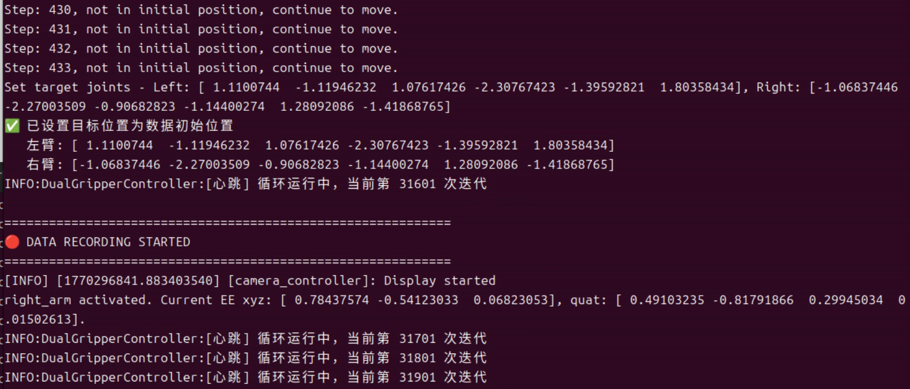
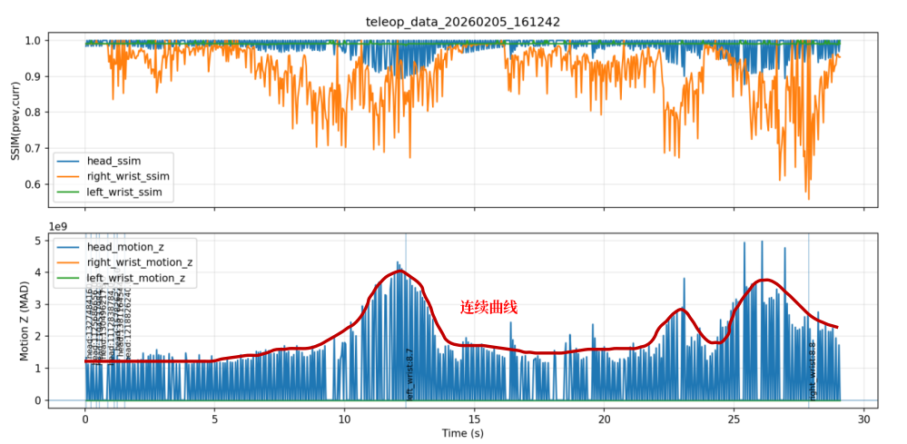
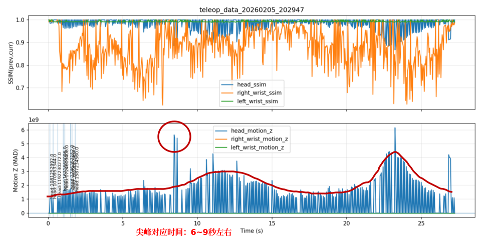
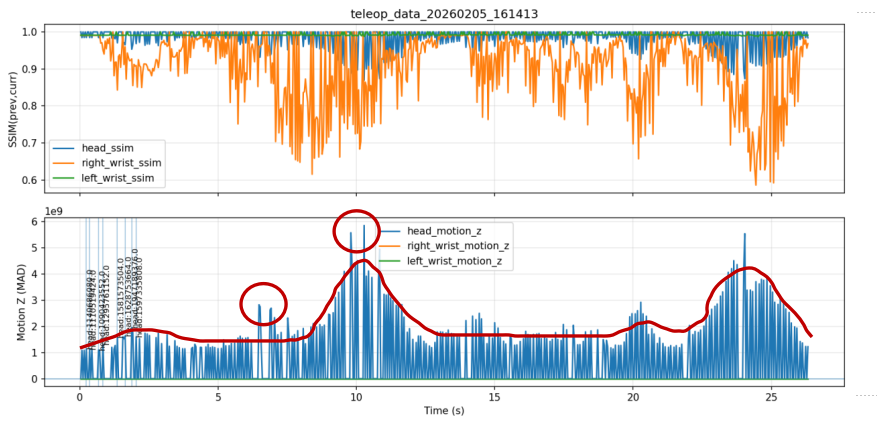
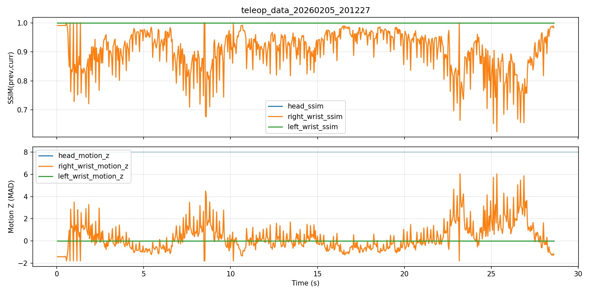

- 启动机器：
    - 底盘，两个机械臂
    - 机械臂可能需要手动启动
    - 充电：正面不能被遮挡，屏幕显示是否充电
    - 走之后，要把所有东西关掉
- no machine 连接：
    - IP: xxx.xxx.xx.x
    - CMCC 网络，xxxxxxx
    - username: xx
    - password: xxx
- 底盘遥控器：
    - 开机，关机：长按中间圆形按钮
    - 前进和后退档
    - X: 平移档
    - 左边摇杆控制移动
    - B, R: 前驱，后驱
- 启动程序：
    - 启动电机：
        ```bash
        cd /home/tl/workspace/plab_controller
        cd docker 
        docker compose up
        ```
    - 旋转 base: 
        ```bash
        docker exec -it zmq_servers bash
        python plab_driver/examples/moons_motor_example.py
        ```
    - 启动相机: 
        ```bash
        cd /home/tl/workspace/ws_vision
        python vision_docker_demo/scripts/start_rest_api.py

        # 验证相机是否启动成功
        # 浏览器 -> 127.0.0.1:7000 -> 图像查看器 -> 连接 -> 查询话题
        ```
    - 启动遥操作：
        ```bash
        cd /home/tl/workspace/pxr
        bash ./scripts/start.sh
        python scripts/hardware/teleop_dual_ur5e_hardware.py

        # 支持录数据后自动回到初始位姿的遥操作
        python scripts/hardware/teleop_dual_ur5e_hardware_back_to_init.py --log_file /path/to/pkl/file 

        # 启动 VR, 连接网络，启动 XRobot
        # 连接局域网
        # 勾选 controller, send
        # 把界面调整到正对机器的朝向

        # 如果有 bug，逐级重启
        # 重启遥操作脚本
        python scripts/hardware/teleop_dual_ur5e_hardware.py
        # 重启遥操作 docker
        bash ./scripts/stop.sh
        bash ./scripts/start.sh
        # 重启电机
        cd /home/tl/workspace/plab_controller
        cd docker 
        docker compose up
        # 重启整个机器
        ```
    - 录数据：
        - 按 B 开始
        - 再按一次结束
          - 若运行的是`teleop_dual_ur5e_hardware_back_to_init.py`，需要等待机械臂回到初始位姿后才能继续遥操。
        - 数据检查：
            ```bash
                # 因为运行环境都在 docker 里面，必须进 docker 里面才能执行脚本
                docker exec -it pxr_container bash 
                cd logs
                python write_video.py --log_file /path/to/your/pkl/file
                # 这个脚本会在 logs 目录下把三个视角的图像写成三个 mp4 文件

                # 这个脚本可以自动化地监测并转换 logs 文件夹下的数据对
                # 将其放到 logs/tmp 下的同名文件夹下
                # 运行该脚本后直接在 logs/tmp 里查看数据即可
                python write_video_multi.py
                # 其中除了视频和原始数据，还有一张名为 quality_curves.png 的图像
                # 可以通过该图像快速判断数据有没有问题以及定位问题可能出现在哪里
            ```
            + 从 quality_curves.png 看数据质量（只看下半张图的曲线）
              + 正常数据：连续平滑的曲线，先多看几条总结出该动作的曲线变化趋势
              + 异常数据：
                + 尖峰：在正常数据趋势的基础上出现了明显的异常峰值，此时可以到对应视频文件的对应时间观察视频是否有问题，通常是在正常数据中混入了不属于该数据或者不属于该时间片的一帧或几帧。这类异常由于较短比较难发现，建议在那段时间多播放几遍检查。大部分时候出现异常尖峰都是有问题的。该类异常总是随机出现。
                异常尖峰并不总是很明显，一些小的尖峰也可能有问题。
                
                + 卡帧：此处头部相机的曲线没有了，对应视频卡住。此时重启相机解决。该类异常通常连续出现。
